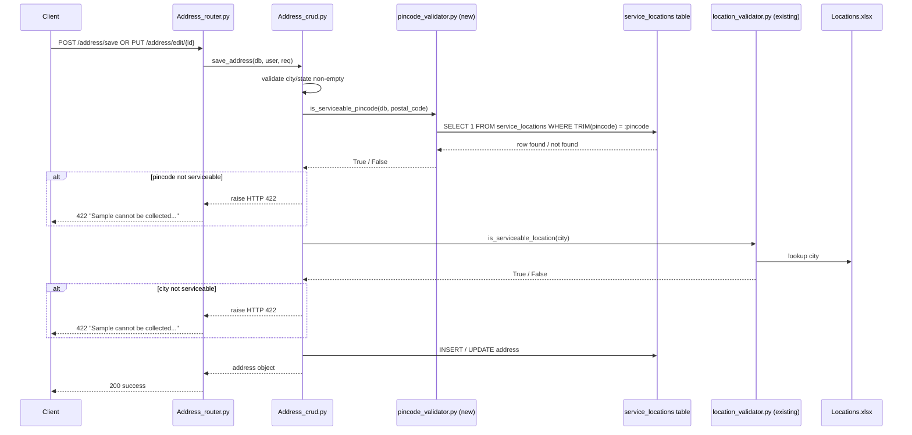

# Design Document

## Feature: Pincode Serviceability Validation

## Overview

This feature extends the existing address save/edit flow with a second, database-backed serviceability check. Currently, `Address_CRUD` validates the submitted city name against a static Excel file (`Locations.xlsx`) via `is_serviceable_location`. This design adds a **pincode check** that runs **before** the city check: the submitted `postal_code` is looked up in the `service_locations` database table, and the request is rejected with HTTP 422 if the pincode is not found.

The two checks are complementary and both remain active:
1. **Pincode check** (new) — queries `service_locations` table via SQLAlchemy.
2. **City check** (existing) — reads `Locations.xlsx` via `is_serviceable_location`.

No changes are needed to the router layer, schemas, or the pincode auto-fill service (`pincode_service.py`).

## Architecture



## Components and Interfaces

### New Component: `Address_module/pincode_validator.py`

A single-function module that encapsulates all database interaction for pincode serviceability.

```python
from sqlalchemy.orm import Session

def is_serviceable_pincode(db: Session, pincode: str) -> bool:
    """
    Return True if the pincode exists in the service_locations table.

    - Strips leading/trailing whitespace from pincode before querying.
    - Returns False immediately for empty or None input (no DB query).
    - Performs a case-insensitive, whitespace-trimmed exact match on
      the `pincode` column of `service_locations`.
    """
```

**Design decisions:**
- Kept as a standalone module (not merged into `location_validator.py`) to maintain separation between the DB-backed check and the file-backed check.
- Accepts a `Session` parameter, consistent with the project's existing dependency-injection pattern (see `deps.py`, `Address_crud.py`).
- Returns a plain `bool` — error raising is the caller's responsibility, keeping the validator pure and easily testable.

### Modified Component: `Address_module/Address_crud.py`

The `save_address` function gains one new block inserted **after** the city/state non-empty checks and **before** the `is_serviceable_location` call:

```python
# NEW: Pincode serviceability check (runs before city check)
from .pincode_validator import is_serviceable_pincode

if not is_serviceable_pincode(db, req.postal_code):
    logger.warning(
        "Address rejected for user %s: pincode='%s' not in service_locations.",
        user.id, req.postal_code,
    )
    raise HTTPException(
        status_code=422,
        detail="Sample cannot be collected in your location. Please choose a different location."
    )
```

No changes are needed to `Address_router.py` — the router already passes `db` to `save_address`, and the edit endpoint already resolves the full `postal_code` before calling `save_address`.

### Unchanged Components

| Component | Role | Change |
|---|---|---|
| `Address_router.py` | HTTP routing, autofill for edit | None |
| `Address_schema.py` | Request/response models | None |
| `location_validator.py` | Excel-based city check | None |
| `pincode_service.py` | Postal API / Redis cache | None |

## Data Models

### `service_locations` table (existing, read-only from this feature)

The user confirmed this table already exists in the database with a corresponding SQLAlchemy model. Based on the requirements glossary:

| Column | Type | Notes |
|---|---|---|
| `id` | Integer PK | |
| `location` | String | Human-readable location name |
| `pincode` | String | 6-digit Indian pincode |
| `city_id` | Integer FK | FK → `serviceable_locations.id` |

The `is_serviceable_pincode` function queries this table using the existing SQLAlchemy model. The query performs a whitespace-trimmed, case-insensitive match on the `pincode` column.

### Query pattern

```python
from sqlalchemy import func

exists = db.query(ServiceLocation).filter(
    func.trim(ServiceLocation.pincode) == pincode.strip()
).first() is not None
```

Using `func.trim` on the DB side and `.strip()` on the Python side satisfies Requirement 3.2 (whitespace trimming) and Requirement 1.4 (exact match after trimming).

## Error Handling

| Scenario | Behaviour |
|---|---|
| `postal_code` is `None` or empty string | `is_serviceable_pincode` returns `False` immediately; no DB query |
| Pincode not in `service_locations` | HTTP 422, detail: `"Sample cannot be collected in your location. Please choose a different location."` |
| City not in `Locations.xlsx` (existing) | HTTP 422, same detail string |
| Both pincode and city would fail | Pincode error is raised first (Requirement 4.1) |
| DB query raises an unexpected exception | Exception propagates; FastAPI returns HTTP 500 — no internal details exposed in the 422 path |

The error message is identical to the existing city serviceability error, satisfying Requirement 5.2 and enabling uniform client-side handling.

Internal details (table names, column names, query results) are never included in the HTTP response body, satisfying Requirement 5.3.


## Correctness Properties

*A property is a characteristic or behavior that should hold true across all valid executions of a system — essentially, a formal statement about what the system should do. Properties serve as the bridge between human-readable specifications and machine-verifiable correctness guarantees.*

### Property 1: Absent pincode yields HTTP 422

*For any* `postal_code` string that does not exist in the `service_locations` table, calling `save_address` (for both create and edit paths) should raise an `HTTPException` with status code `422` and detail `"Sample cannot be collected in your location. Please choose a different location."`.

**Validates: Requirements 1.2, 2.2, 5.1, 5.2**

### Property 2: Present pincode passes the pincode check

*For any* `postal_code` string that exists in the `service_locations` table, calling `save_address` should not raise an `HTTPException` due to the pincode check (subsequent city or other validations may still raise errors, but the pincode check itself must pass).

**Validates: Requirements 1.3, 2.3**

### Property 3: Whitespace trimming does not affect serviceability result

*For any* pincode `p` that is serviceable, `is_serviceable_pincode(db, p)` and `is_serviceable_pincode(db, "  " + p + "  ")` should return the same value (`True`). Equivalently, storing a pincode with surrounding whitespace in the DB and querying with the trimmed version should still return `True`.

**Validates: Requirements 1.4, 3.2**

### Property 4: Validator round-trip correctness

*For any* pincode seeded into `service_locations`, `is_serviceable_pincode(db, pincode)` returns `True`; for any pincode not seeded, it returns `False`; for an empty string or `None` input, it returns `False` without issuing a DB query. (Edge cases: `""`, `None`, and whitespace-only strings all return `False`.)

**Validates: Requirements 3.1, 3.3**

### Property 5: Pincode check fires before city check

*For any* request where the pincode is absent from `service_locations` (regardless of whether the city is serviceable or not), the `HTTPException` is raised at the pincode validation step, meaning `is_serviceable_location` is never called.

**Validates: Requirements 4.1, 4.2**

### Property 6: Error response contains no internal database details

*For any* non-serviceable pincode, the HTTP 422 response body must not contain the strings `"service_locations"`, `"pincode"` (as a column reference), `"city_id"`, or any SQL fragment.

**Validates: Requirements 5.3**

## Testing Strategy

### Dual Testing Approach

Both unit tests and property-based tests are required. They are complementary: unit tests cover specific examples and integration points; property tests verify universal correctness across randomised inputs.

### Property-Based Testing

**Library:** [`hypothesis`](https://hypothesis.readthedocs.io/) (Python)

Each property-based test must run a minimum of **100 iterations** (configured via `@settings(max_examples=100)`).

Each test must include a comment referencing the design property it validates, using the format:
`# Feature: pincode-serviceability-validation, Property <N>: <property_text>`

| Design Property | Test description | Pattern |
|---|---|---|
| P1 | Generate random pincodes not in DB; assert HTTP 422 with exact message | Error condition |
| P2 | Seed random pincodes; assert no 422 from pincode check | Round-trip / positive path |
| P3 | Seed pincode; query with padded variants; assert same True result | Metamorphic |
| P4 | Seed/unseed random pincodes; assert True/False; test None/"" edge cases | Round-trip + edge case |
| P5 | Absent pincode + any city; assert city validator never called (mock) | Ordering invariant |
| P6 | Non-serviceable pincode; assert response body has no DB internals | Error condition |

### Unit Tests

Unit tests should focus on:
- Specific examples: known serviceable and non-serviceable pincodes.
- Integration: `save_address` end-to-end with a test DB session.
- Edge cases: `None`, `""`, whitespace-only, 5-digit, 7-digit strings passed to `is_serviceable_pincode`.
- Ordering: confirm `is_serviceable_location` is not invoked when pincode check fails (use `unittest.mock.patch`).

Avoid duplicating coverage already provided by property tests. Unit tests should not exhaustively enumerate pincode values — that is the job of Hypothesis.

### Test File Location

```
Address_module/tests/
    test_pincode_validator.py      # Property + unit tests for is_serviceable_pincode
    test_address_crud_pincode.py   # Integration tests for save_address pincode gate
```
